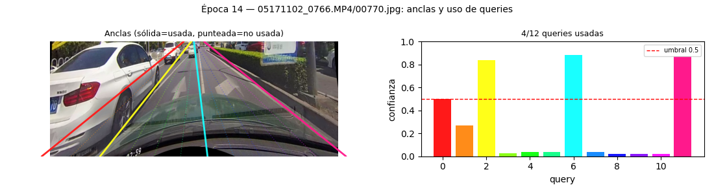
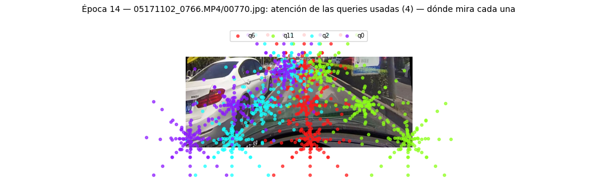
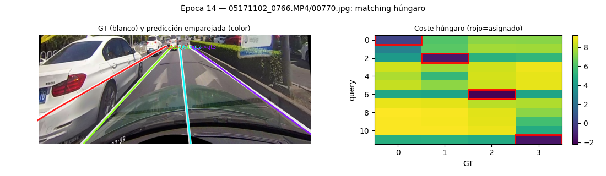
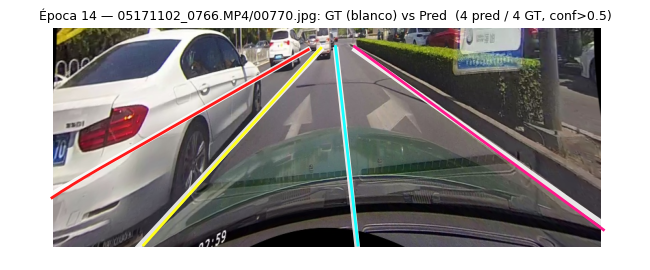

# LaneTR — Detección de Carriles con Transformers Deformables

**LaneTR** — detector de carriles basado en *Transformer* con **atención deformable**, **prior
posicional** (anclas) y **asignación húngara** uno-a-uno **sin supresión de no-máximos (NMS)**,
entrenado con la **LaneIoU** sensible al ángulo como *coste de asignación* y como *función de
pérdida*. Este repositorio es la **instancia congelada** del modelo: un paquete Python instalable
que la plataforma VisualRoad **ML Training** consume por SHA para entrenar en GCP Vertex AI.

> Las figuras de este documento son salidas reales de los **visualizadores** del modelo sobre una
> escena de CULane (época 14 de un entrenamiento). Ilustran, módulo a módulo, el funcionamiento de
> la red descrito en la Sección 1.

---

## 1. La red: arquitectura y funcionamiento

### 1.1. Planteamiento

El problema de la detección de carriles consiste en estimar, a partir de una imagen de carretera,
el conjunto de **líneas de carril** presentes. LaneTR aborda la tarea como un problema de
**detección por conjuntos** (*set prediction*) al estilo DETR: un número fijo de *consultas*
(**queries**) compite por explicar los carriles de la escena, y cada consulta produce —o no— un
carril. A diferencia de los detectores clásicos basados en anclas densas y NMS, la correspondencia
entre predicciones y anotaciones se resuelve mediante una **asignación húngara uno-a-uno**, lo que
elimina la necesidad de post-procesado por NMS.

La canalización de inferencia es la siguiente:

```
imagen (cualquier resolución)
   └─► redimensionado a 800×320 (recorte de cielo + escalado)
        └─► backbone DLA-34            ─► mapas multiescala  C3, C4, C5
             └─► FPN                   ─► pirámide de rasgos P3, P4, P5 (256 canales)
                  └─► decoder Transformer deformable (6 capas, 12 queries)
                       └─► cabezas por query ─► {confianza, xs, inicio, longitud}
                            └─► umbral de confianza ─► ≤ 4 carriles (formato común .lines.json)
```

### 1.2. Representación del carril

Cada carril no se modela como una polilínea libre, sino mediante una **representación de
filas-ancla** (estilo CLRNet): se fija un conjunto de **144 filas horizontales** con coordenada
`y` predeterminada y, para cada fila, la red predice la coordenada `x` del carril. Una consulta
emite, por tanto, un vector de 144 valores de `x`, la fila de inicio (`start_y`) y la longitud
vertical (`length`). Esta parametrización regular es la que permite calcular la **LaneIoU** fila a
fila y hace que la métrica y la visualización sean **agnósticas a la arquitectura**.

### 1.3. Prior posicional: anclas y consultas

Cada consulta nace asociada a un **ancla**: una línea-recta-prior definida por su punto de inicio,
su pendiente y su longitud. Las anclas se inicializan **en abanico**, cubriendo la imagen de borde
a borde, de modo que cada consulta parte de una hipótesis distinta desde el primer paso; esto
estabiliza la asignación húngara dinámica, cuya inestabilidad inicial es un problema conocido en
los modelos tipo DETR. La cabeza no predice `x` desde cero, sino como **prior + desviación**
(`x = recta_del_ancla + Δ`), de manera que la red solo aprende la corrección sobre el ancla.



*Figura 1. Izquierda: la línea-prior de cada una de las 12 anclas sobre la escena (trazo continuo =
consulta utilizada, con confianza ≥ 0,5; trazo punteado = no utilizada). Derecha: la confianza
predicha por consulta; solo 4 de las 12 superan el umbral, una por cada carril real de la imagen.*

### 1.4. Atención deformable

El decoder es un *Transformer* en el que las consultas (a) se relacionan entre sí mediante
**auto-atención** y (b) consultan los rasgos de la imagen mediante **atención deformable**. En
lugar de atender a la totalidad de las ~5 250 celdas de la pirámide de rasgos (atención densa), cada
consulta **muestrea unos pocos puntos** alrededor de sus **puntos de referencia** —situados a lo
largo del carril candidato— y aprende dónde desplazarlos. El coste resulta así independiente de la
resolución, y la posición se codifica de forma implícita en *dónde* muestrea cada consulta (por lo
que no se requiere codificación posicional aditiva). Los puntos de referencia se **refinan capa a
capa**, acercándose progresivamente al carril predicho.



*Figura 2. Para cada una de las 4 consultas activas, los puntos que su atención deformable muestrea
sobre la imagen. Cada color es una consulta distinta; obsérvese cómo cada nube de puntos se
concentra en torno al carril que esa consulta explica.*

### 1.5. Asignación húngara y LaneIoU (la aportación de la tesis)

Durante el entrenamiento, cada carril anotado (*ground truth*, GT) debe emparejarse con exactamente
una consulta. Este emparejamiento se formula como un problema de **asignación de coste mínimo** y se
resuelve con el **algoritmo húngaro**. El coste combina un término de clasificación (*focal*), un
término geométrico (**1 − LaneIoU**) y términos de regresión (`L1` sobre `xs` y sobre la extensión).
La **LaneIoU** es una intersección-sobre-unión diferenciable y **sensible al ángulo**: ensancha la
banda de cada carril en los tramos inclinados, correlacionando mejor con la métrica oficial de
evaluación. La novedad metodológica de este trabajo consiste en emplear la LaneIoU **simultáneamente
como coste de la asignación húngara y como función de pérdida** dentro de un decoder tipo DETR.



*Figura 3. Izquierda: anotación (blanco) y predicción emparejada (color). Derecha: la matriz de
coste húngaro (consulta × GT); el recuadro rojo marca la asignación óptima de cada carril GT a una
consulta. Al ser uno-a-uno, el modelo no necesita NMS.*

### 1.6. Salida

Tras el umbral de confianza, la red emite **a lo sumo 4 carriles** (el máximo anotado en CULane),
cada uno con su confianza. La predicción se devuelve en el **formato común `.lines.json`**, con los
puntos expresados en la **resolución nativa** de la imagen de entrada.



*Figura 4. Resultado final: anotación (blanco) frente a la predicción de la red (colores) sobre una
escena con 4 carriles. La red recupera los 4 carriles con confianza superior al umbral.*

### 1.7. Resoluciones heterogéneas

El modelo opera **siempre a 800×320**. Como los datos provienen de fuentes con distinta resolución
(p. ej. CULane 1640×590, cámara de usuario 1280×720), la capa de datos (`lanetr/data`) recorta la
franja superior (cielo) —expresada como **fracción de la altura**, válida para cualquier
resolución— y redimensiona; en inferencia, `predict()` aplica la transformación inversa para
devolver los carriles en la resolución de origen. Así, el entrenamiento y la métrica comparan
siempre a igual escala.

---

## 2. Integración con ML Training y contrato del modelo

### 2.1. Cómo se integra

Este repositorio **no entrena ni despliega**: produce un **paquete Python instalable** (`lanetr`).
La plataforma ML Training lo consume **fijándolo por SHA** dentro de la imagen `trainer`:

```bash
pip install "git+https://github.com/VisualRoadLabs/visualroad-lanetr@<sha>"
```

Esa imagen `trainer` (código de la plataforma + este paquete) se ejecuta como un *Vertex Custom
Job*, lanzado por un *workflow* desde el panel de control. La plataforma interactúa con el modelo
**exclusivamente a través de su contrato** —nunca de su arquitectura interna—, importando desde
`lanetr.contract` (los `__init__.py` se mantienen vacíos a propósito; se importa siempre del
submódulo):

```python
from lanetr.contract.build import build_model, build_criterion, build_param_groups
from lanetr.contract.spec  import MODEL_INFO, CONFIG_SCHEMA, METRICS_SPEC
from lanetr.contract.visualizers import VISUALIZERS
```

Adicionalmente, la integración con la base de datos descansa en el **formato común `.lines.json`**
(tanto el GT como las predicciones) y en la exportación, vía CI, de los artefactos declarativos
(`config_schema.json`, `model_info.json`, `metrics_spec.json`) al *bucket* de datasets
(`_model/<modelo>@<sha>/`), de donde el panel de control los lee sin necesidad de importar PyTorch.

### 2.2. El contrato

El **contrato** es la frontera estable entre el modelo y la plataforma. Su corolario es que ML
Training **no depende de LaneTR**, sino de una interfaz que LaneTR satisface; en consecuencia,
sustituir el modelo se reduce a proporcionar otra implementación del mismo contrato.

| Superficie | Tipo | Responsabilidad |
|---|---|---|
| `build_model(cfg)` | `nn.Module` | construir la red a partir de la configuración |
| `build_criterion(cfg)` | `nn.Module` | construir la función de pérdida |
| `build_param_groups(model, cfg)` | `list[dict]` | grupos de parámetros con tasa de aprendizaje diferenciada |
| `model.forward(images)` | `dict` | salida cruda por capa (para pérdidas auxiliares) |
| `model.predict(images, src_sizes=…)` | `list[dict]` | carriles en **formato común** `.lines.json`, en resolución nativa |
| `MODEL_INFO` | `dict` | identidad y forma de entrada/salida |
| `CONFIG_SCHEMA` | `list[dict]` | hiperparámetros barribles (grupos `arch · optim · schedule · loss · data`) |
| `METRICS_SPEC` | `dict` | etiquetas y orden de los escalares registrados |
| `VISUALIZERS` | `dict[str, fn]` | figuras específicas del modelo (`anchors`, `attention`, `matcher`) |

### 2.3. Requisitos para una red nueva o alternativa

Para introducir una **arquitectura distinta** —o reimplementar esta de otra forma— sin modificar la
plataforma, la nueva red debe **satisfacer el contrato**. En concreto, ha de:

1. **Exponer las fábricas** `build_model(cfg)` y `build_criterion(cfg)` que devuelvan módulos de
   PyTorch a partir de un `cfg` (diccionario anidado) fusionado con los *overrides* del formulario.
2. **Respetar el contrato de entrada**: aceptar tensores de imagen `(N, 3, 320, 800)`.
3. **Implementar `model.predict(...)`** de modo que devuelva la salida en **formato común
   `.lines.json`** (lista de carriles de puntos `{x, y}` en píxeles de la resolución de origen, con
   `Scores` por carril y un máximo de carriles acotado). Es el único punto que consume la métrica.
4. **Declarar las piezas del panel**: `MODEL_INFO`, `CONFIG_SCHEMA` (cada campo con `path`, `type`,
   `default`, `group` y `label`), `METRICS_SPEC` y `VISUALIZERS` (cada visualizador con la firma
   `fn(model, batch, out) -> imagen`).
5. **Registrar la pérdida en formato largo**: el `criterion` debe devolver un diccionario de
   términos con nombre (p. ej. `cls`, `iou`, `xy`, `ext`, `total`); la plataforma los registra como
   curvas sin conocer su significado.
6. **Superar el *conformance*** (`conformance/test_contract.py`): verifica las formas de
   `forward`/`criterion`, que `predict()` produce el formato común, que `CONFIG_SCHEMA` se analiza
   correctamente y que cada visualizador se ejecuta y devuelve una imagen.

Cumplidos estos requisitos, **el reemplazo se reduce a fijar el nuevo SHA y volver a exportar los
tres ficheros declarativos**; ni la interfaz de usuario, ni la métrica, ni la visualización, ni la
capa de orquestación en la nube requieren modificación alguna.

---

## 3. Desarrollo

```bash
pip install -e ".[dev]"
pytest -q tests/                       # pruebas unitarias (modelo, datos, pérdidas)
python conformance/test_contract.py    # conformance del contrato
python tools/export_contract.py --out ./_contract   # generar los JSON declarativos
```

La implementación local de referencia (con sus experimentos y *ablations*) se conserva en `old/`
únicamente a título documental; el paquete distribuible contiene **solo** el modelo congelado.
